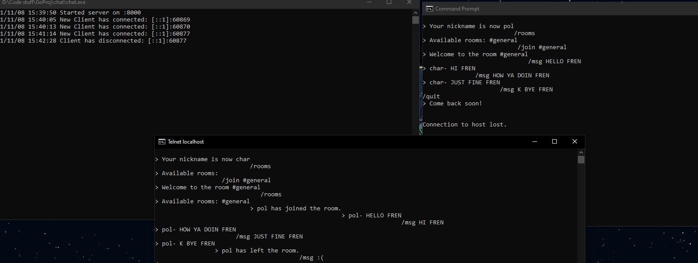

# TCP based Client/Server chat CLI in Go

Written in Go, this is a simple implementation of a TCP server that can detect new clients connecting and disconnecting, and can handle multiple clients with the help of Goroutines. Simple chat commands and rooms have been implemented. The server can theoretically be deployed to an external source, however for now my testing has been carried out over Localhost with Telnet. The commands include the following:  

* `/nick`: sets the user's nickname. Anonymous by default
* `/join`: joins the specified room. Creates a room if the specified room does not exist
* `/rooms`: lists all available rooms that currently exist
* `/msg`: sends the following text as a broadcast message to the room
* `/quit`: quits the current session and disconnects the client

- - - -

An example of the app in action: 

